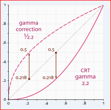

Smart Charger Case of AB1532 by STM8S003
========
  Airoha耳机方案充电盒用STM8S003替代常见的低成本MCU。

参考线路ChargerCase_ref.pdf是洛达充电盒常见的MCU方案，如果UI要求4个LED同时支持呼吸灯
功能，这种低成本MCU就满足不了需求。
低成本MCU通常只有一路PWM输出，如果要支持LED呼吸灯功能，支持4个LED时用硬件方式实现呼吸
灯需要5个GPIO口，16脚MCU(14个GPIO口)就会出现GPIO口不够用。

设计目标
在满足洛达充电盒基本功能需求之外，支持以下需求:
1.  flash型MCU
2.  最多支持4个LED
3.  4路PWM并可独立控制
4.  支持Hall Sensor
5.  至少支持一个按键
6.  支持充电设备检测
7.  5V常在条件下平均静态电流不大于100uA

为什么是STM8S003？
ST是通用MCU市场的TOP3之一，STM8S003成本在能接受的范围内(相比于低成本MCU)，资源完全满
足规划的充电盒的功能需求,用其它家的类似MCU也是完全可行，比如新唐N76E003AT20，据说是
与STM8S003 PIN脚兼容。
对于规模不大的工厂，用一套充电盒方案解决现在及未来可能存在的需求变化，替代现有的数种甚
或更多种充电盒方案，以降低业务/开发/仓储成本，值得去探讨。
低成本MCU基本上都是OTP MCU，只能烧录一次，软件无法升级。每家工厂都会有委货或一定数量的
备品，或者更改UI就能改成另外一款产品，从工厂的角度而言在此所讨论的充电盒方案还是有一定
的意义。

为什么要4路PWM可独立控制？
目前在TWS耳机市场，充电盒LED数量4/3/1都有，超过4个LED的可能有但大多数客户的产品最多是
4个。未来充电盒UI是否有客户会提需要LED都是呼吸灯的情况，这个不太确定，如果MCU支持CCP能
同时输出4路PWM或更多路PWM，基本上能满足可能出现的UI需求变化。

为什么要支持Hall Sensor？
目前所接触到的洛达TWS耳机方案在电商客户群体的趋势是充电盒开盖开机，有些客户UI要求左右耳
同步关机，如果有一个耳机电量不足时放入充电盒充电在未关盖时另一个耳机还能继续使用。

为什么充电盒要支持按键功能？
大多数TWS耳机在销售到终端用户手中时没有TWS配对功能(工厂在生产时配对好出货)，用户端存在
的TWS配对需求通过按键功能来实现。

为什么要定义功耗需求？
洛达方案充电盒UI要求通常是在关盖时耳机充满电5V才关闭，此时充电盒进入低功耗状态(MCU进入
低电状态)，充电盒功耗在此条件下电流大多数都能做到20uA以下。在5V常在条件下平均静态电流普
遍都在1mA左右，有的甚至能达到2mA以上，对于充电盒本身电池只有600mAH左右的容量而言，无论
是MCU本身资源的限制还是其它原因，功耗都太大，可能放一晚上电池盒就处于低电状态了。

## LED Gammar Correction
简单的呼吸灯通常是将PWM占空比从0加到100，再从100减到0，往复变化。这样做的缺点是LED显示
在视觉上是突然间变亮或变暗，因此在PWM调光中引入Gamma Correction，来获得比较满意的灰度
变化(线性渐变)。

(关于Gamma的意义，可以参阅以下文章：
    色彩校正中的gamma值是什么
    https://www.zhihu.com/question/27467127
)

\
\
\
\
取： Output = Input ^ (1/Gamma)\
     (Gamma = 2.2)\

如果直接将数学公式引入代码中去计算，STM8S003主频最高16MHz，运算量太大跑不动。

换种思路：Output是我们希望的线性渐变的灰度的百分比值(从0到100%，简化计算，只取整数值\
         0--100)，Input端是输入的PWM占空比，因为PWM周期未定，无法直接得到PWM占空比数\
         值。\
         先偿试以0--100的数值代入Input求得Output,再观察Input与Output数值的变化, 然\
         后再将Input数值逐渐加大，当Output数值为1时的Input值就是我们想要得到的PWM周\
         期，相应的就得到一个0--100%的table表 (范例代码中只取前面100个数字，刚好\
         100步)。\

/**\
  * gamma = 2.2\
  * Output = Input^(1/gamma)\
  */\
CONST uint16_t gamma_table[100] = {\
	    0,     1,     5, 	  11,    21,    35,    51,    72,    97,   126,\
	  158,   195,   237,   282,   332,   387,   446,   509,   577,   650,\
	  728,   811,   899,   991,  1088,  1189,  1297,  1409,  1526,  1649,\
	 1777,  1910,  2048,  2191,  2340,  2494,  2654,  2819,  2989,  3165,\
	 3346,  3533,  3725,  3923,  4127,  4336,  4551,  4771,  4997,  5229,\
	 5467,  5710,  5960,  6215,  6475,  6742,  7015,  7293,  7578,  7867,\
	 8165,  8467,  8775,  9090,  9410,  9737, 10069, 10408, 10753, 11104,\
	11461, 11824, 12194, 12569, 12951, 13339, 13734, 14135, 14542, 14955,\
	15375, 15801, 16233, 16672, 17117, 17568, 18026, 18490, 18961, 19438,\
	19922, 20412, 20909, 21412, 21922, 22439, 22962, 23491, 24027, 24570,\
/*	25119,*/\
};\
\
这个table表是否能为STM8S003所用？\
STM8S003输出4路PWM只能选用TIM1, 16位自动重载定时器，PWM最大脉冲宽度25119 < 2^16, 只
要将TIM1自动重载值设为大于或等于PWM最大脉冲宽度，就能实现PWM从0--100%变化。

@par Example Description
This example provides a short description of how to use the TIM1 PWM peripheral:
Change the macro define in chgcase_cfg.h listed as below before compile,
TIM1_CH [1:4] will output corresponding PWM pulse.

#define GUI_ALL_ON 					    1 //fixed pwm duty
//#define GUI_MARQUEE 					1 //marquee control
//#define GUI_LUMOS 					  1 //breathing light

@par HINT
- Before using TIM1_CH3 and TIM1_CH4 you have to configure option bytes in order
  to enable alternate function.
- To do so
  - With EWSTM8 (menu: ST-Link -> Option bytes -> AFR0 = Alternate Active)
